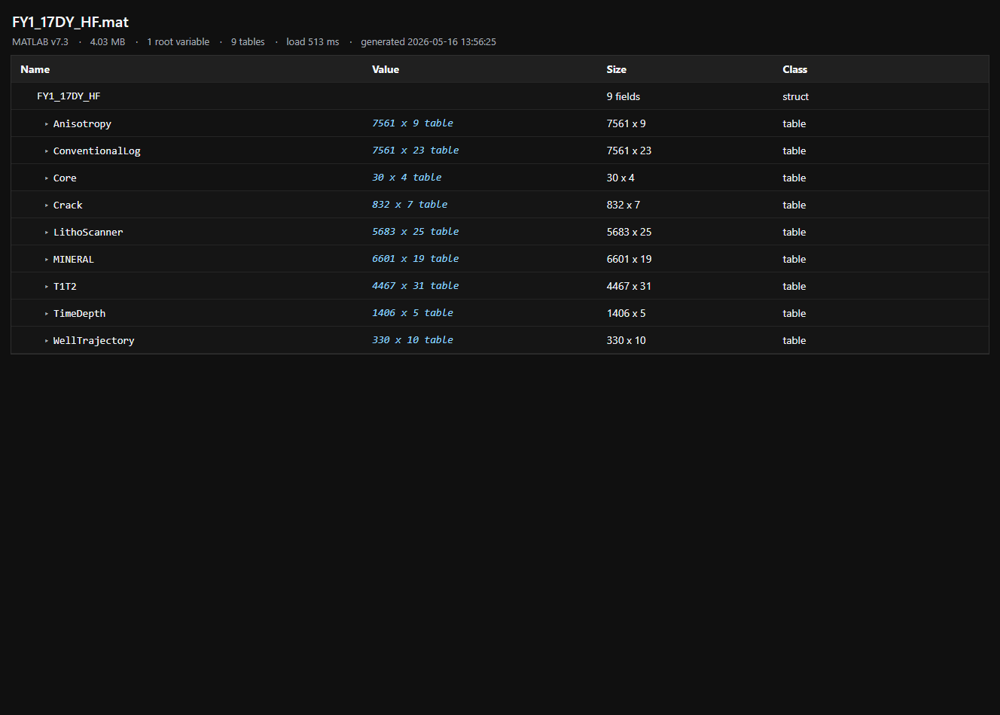
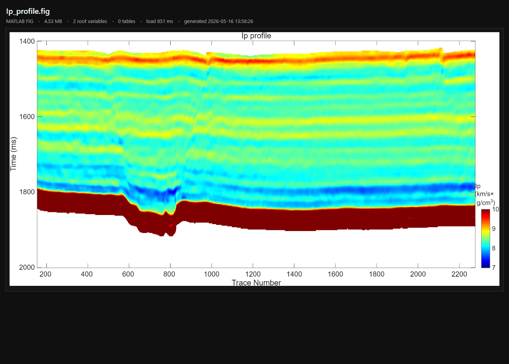

<div align="center">

# SeerMat

**用于 [Seer](https://1218.io/) 的 MATLAB `.mat` / `.fig` 快速预览插件。**

[中文](README.md) · [繁體中文](README.zh-TW.md) · [English](README.en.md)


</div>

SeerMat 可以在资源管理器中直接预览 MATLAB 文件，不必打开 MATLAB。它重点展示用户真正关心的内容：变量结构、struct 字段、table 行列信息、table 列名，以及 `.fig` 图像预览。

## 预览效果

MAT 文件变量结构：



FIG 图像预览：



## 功能特性

- 支持在 [Seer](https://1218.io/) 中预览 MATLAB `.mat` 和 `.fig` 文件。
- 支持 MATLAB v6/v7 MAT-file，基于 `scipy` 读取。
- 支持 MATLAB v7.3 HDF5 MAT-file，基于 `h5py` 读取。
- 尽量还原 MATLAB 语义，而不是直接显示 HDF5 内部引用编号。
- `struct` 显示为字段树。
- v7.3 `table` 显示真实行列数，并可展开为列字段列表。
- 普通 numeric / char / string 变量可显示轻量数据预览。
- `.fig` 文件在 MATLAB 可用时渲染为图片预览。
- `.fig` 渲染结果会缓存，重复预览同一个未修改文件会更快。
- 支持系统浅色 / 深色主题。

## 依赖

- Windows
- [Seer](https://1218.io/) `4.1.3` 或更新版本
- Python 3，需要在 `PATH` 中可用
- Python 包：

```powershell
pip install numpy scipy h5py
```

可选：

- MATLAB，需要在 `PATH` 中可用；只有渲染 `.fig` 图片预览时需要。

如果系统没有 `python` 命令，插件也会尝试使用 Windows 的 `py -3` 启动器。

## 安装

1. 下载或克隆本仓库。
2. 安装 Python 依赖：

```powershell
pip install numpy scipy h5py
```

3. 在 Seer 插件管理中添加本项目的 `plugin.json`。
4. 重启 Seer。
5. 在资源管理器中选中 `.mat` 或 `.fig` 文件，按 Seer 预览快捷键。

## 缓存说明

更新插件后，请先重启 Seer。如果同一个 `.mat` 或 `.fig` 文件仍显示旧界面，可以清理 Seer 的临时 HTML 缓存：

```powershell
Get-ChildItem "$env:TEMP\Seer" -Filter *.html -ErrorAction SilentlyContinue | Remove-Item -Force
```

`.fig` 渲染出的 PNG 图片会缓存在：

```text
%TEMP%\SeerMat\fig-cache
```

如果 `.fig` 文件大小或修改时间发生变化，插件会自动重新渲染。

## 项目文件

```text
plugin.json     Seer 插件清单
entry.ps1       Seer 调用的 PowerShell 入口
mat_to_html.py  MAT / FIG 解析与 HTML 渲染脚本
assets/         README 截图资源
template/       预留模板目录
```

## 开发调试

可以直接运行转换脚本测试输出：

```powershell
python .\mat_to_html.py path\to\input.mat preview.html
```

然后用浏览器打开 `preview.html` 查看结果。

## 限制

- 插件面向快速预览，不是完整 MAT-file 转换器。
- 非常大或层级很深的对象会被摘要化，避免 Seer 卡住。
- MATLAB opaque 对象、自定义类和旧式 table 内部结构可能只能显示部分元数据。
- `.fig` 图片渲染需要 MATLAB；如果 MATLAB 不可用，会回退到图形对象结构预览。

## 许可证

暂未指定许可证。公开分发前建议补充明确的开源许可证。

## 致谢

感谢 [Seer](https://1218.io/) 提供轻量、快速的文件预览平台，让这个 MATLAB 文件预览插件成为可能。
